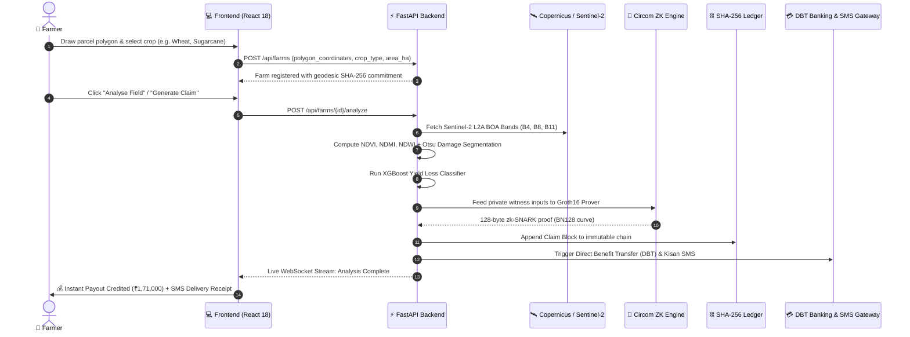

<div align="center">

<!-- HERO BANNER -->


# 🛰️ AGRIPROOF.AI
### Autonomous Satellite-Verified Crop Insurance with Zero-Knowledge Proofs

<p align="center">
  <b>Objective • Privacy-Preserving • Instant Parametric Settlement (< 2 Seconds)</b>
</p>

[](https://opensource.org/licenses/MIT)
[](https://docs.circom.io/)
[](https://soliditylang.org/)
[-10b981?style=for-the-badge&logo=nasa&logoColor=ffffff&labelColor=0f172a)](https://sentinels.copernicus.eu/)
[](https://vitejs.dev/)
[](https://fastapi.tiangolo.com/)

---

> ⚡ **THE CORE PROBLEM & OUR SOLUTION**
> 
> *Traditional crop insurance (PMFBY, USDA) takes **60–90 days** with subjective surveyor visits, corruption, and 30%+ administrative overhead. **AgriProof AI** executes **guaranteed, automated payouts in < 2 seconds** driven directly by objective European Space Agency (ESA) Sentinel-2 satellite telemetry.*
> 
> *Using **Groth16 Zero-Knowledge Proofs (zk-SNARKs)**, farmers mathematically prove genuine damage to insurers without leaking confidential farm coordinates, boundaries, or private revenue history.*

---

</div>

## 📑 Table of Contents
1. [End-to-End System Architecture](#-system-architecture)
2. [Dataflow & Sequence Pipeline](#-dataflow--sequence-pipeline)
3. [The 7-Stage Remote Sensing Pipeline](#-the-7-stage-remote-sensing-pipeline)
4. [Zero-Knowledge Proof (ZKP) Architecture](#-zero-knowledge-proof-zkp-architecture)
5. [Dynamic Parametric Settlement Formulas](#-dynamic-parametric-settlement-formulas)
6. [Direct Farmer Payout (DBT & SMS Receipts)](#-direct-farmer-payout-dbt--sms-receipts)
7. [Insurer Risk Heatmap & Anti-Fraud Shield](#-insurer-risk-heatmap--anti-fraud-shield)
8. [Local Quickstart & Execution](#-local-quickstart--execution)
9. [Smart Contract Verification](#-smart-contract-verification)

---

## 🏛️ System Architecture

AgriProof AI operates as a **modular 6-layer decoupled stack**:

```
+─────────────────────────────────────────────────────────────────────────────────────────────+
|                                    AGRIPROOF AI SYSTEM STACK                                 |
+─────────────────────────────────────────────────────────────────────────────────────────────+

   LAYER 1: EARTH OBSERVATION & TELEMETRY INGESTION
   ┌───────────────────────────┐   ┌───────────────────────────┐   ┌────────────────────────┐
   │ 🛰️ ESA Copernicus S2A/S2B │   │ 🛰️ PlanetScope 3m Surface │   │ 🌦️ Open-Meteo / CHIRPS │
   │    L2A BOA Reflectance    │   │    High-Res Micro-Sat     │   │    Precipitation Grid  │
   └─────────────┬─────────────┘   └─────────────┬─────────────┘   └───────────┬────────────┘
                 └───────────────────────────────┼─────────────────────────────┘
                                                 ▼
   LAYER 2: MULTI-SPECTRAL PROCESSING & AI INFERENCE ENGINE (FastAPI)
   ┌────────────────────────────────────────────────────────────────────────────────────────┐
   │ • Spectral Raster Calculation: NDVI, NDMI (Moisture), NDWI, EVI, SAVI, BSI             │
   │ • Cloud/Shadow Removal: s2cloudless Pixel Masking                                      │
   │ • Otsu Variance Optimization: Bimodal Damage Classification & Land Zoning               │
   │ • XGBoost Regressor: Yield Loss Estimation & Degradation Probability Mapping           │
   └─────────────────────────────────────────────┬──────────────────────────────────────────┘
                                                 ▼
   LAYER 3: PRIVACY-PRESERVING ZERO-KNOWLEDGE PROVER (Circom 2.1 / Groth16)
   ┌────────────────────────────────────────────────────────────────────────────────────────┐
   │ • Private Witness: [ GPS Geodesic Polygon, Farmer Secret, Baseline Reflectance ]       │
   │ • Arithmetic Circuit: Evaluates `ΔNDVI ≥ 30%` & `Rainfall Deficit ≥ 40%`               │
   │ • Public Signals: [ Poseidon Commitment Hash, Policy Threshold, Loss Eligibility ]     │
   │ • Prover Time: ~45ms on BN128 pairing curve                                            │
   └─────────────────────────────────────────────┬──────────────────────────────────────────┘
                                                 ▼
   LAYER 4: PARAMETRIC RULES & DIRECT SETTLEMENT ENGINE
   ┌────────────────────────────────────────────────────────────────────────────────────────┐
   │ • Dynamic Payout Formulation: Coverage = Area(Ha) × Base Rate × Multiplier             │
   │ • Deductible Factoring & Loss Severity Indexing                                        │
   │ • Direct Benefit Transfer (DBT) Payout Trigger via Aadhaar Payment Bridge (APB)        │
   └─────────────────────────────────────────────┬──────────────────────────────────────────┘
                                                 ▼
   LAYER 5: IMMUTABLE AUDIT LEDGER (SHA-256 Block Engine)
   ┌────────────────────────────────────────────────────────────────────────────────────────┐
   │ • Cryptographic Block Hashing: Satellite Evidence Hash + Prediction Hash + ZK Hash     │
   │ • Tamper-Proof Chain: Genesis Block ➔ Block #N with Immutable Merkle Commitments       │
   └─────────────────────────────────────────────┬──────────────────────────────────────────┘
                                                 ▼
   LAYER 6: MULTI-CHANNEL PRESENTATION & DISPATCH INTERFACES
   ┌───────────────────────────┐   ┌───────────────────────────┐   ┌────────────────────────┐
   │ 💻 Interactive GIS Studio │   │ 📲 Kisan SMS & WhatsApp   │   │ 🏛️ Insurer Solvency    │
   │    Vite + React 18 + WSS  │   │    Zero-Internet Dispatch │   │    Basin Heatmap & ZK  │
   └───────────────────────────┘   └───────────────────────────┘   └────────────────────────┘
```

---

## 🔄 Dataflow & Sequence Pipeline



---

## 🔬 The 7-Stage Remote Sensing Pipeline

```
[ Stage 1: Geodesic ROI ] ──► [ Stage 2: Planet/S2 Ingest ] ──► [ Stage 3: Cloud Masking ]
                                                                          │
[ Stage 6: Vectorization ] ◄── [ Stage 5: Otsu Damage ] ◄── [ Stage 4: Band Extraction ]
           │
           └──► [ Stage 7: Groth16 Proof & SHA-256 Ledger Mining ]
```

### Mathematical Formulations:

1. **Normalized Difference Vegetation Index (NDVI)**:
   $$\text{NDVI} = \frac{\text{NIR} (B8) - \text{RED} (B4)}{\text{NIR} (B8) + \text{RED} (B4)}$$

2. **Normalized Difference Moisture Index (NDMI)**:
   $$\text{NDMI} = \frac{\text{NIR} (B8) - \text{SWIR} (B11)}{\text{NIR} (B8) + \text{SWIR} (B11)}$$

3. **Enhanced Vegetation Index (EVI)**:
   $$\text{EVI} = 2.5 \times \frac{\text{NIR} - \text{RED}}{\text{NIR} + 6\text{RED} - 7.5\text{BLUE} + 1}$$

4. **Otsu Bimodal Variance Optimization ($\sigma_B^2$)**:
   $$\sigma_B^2(t) = \omega_0(t)\omega_1(t) \left[\mu_0(t) - \mu_1(t)\right]^2$$

---

## 🔐 Zero-Knowledge Proof (ZKP) Architecture

### Why ZKP for Agriculture?
In traditional insurance, proving crop damage requires disclosing cadastral surveys, revenue, and GPS boundaries. With AgriProof AI:
* **Private Inputs (Encrypted on Device)**: Exact latitude/longitude polygon, farmer secret ID, historical yield records.
* **ZK Circuit (Black Box Proof)**: Evaluates $\Delta\text{NDVI} \ge \text{Policy Threshold}$ and verifies Poseidon hash commitment.
* **Public Output (Visible to Insurer)**: A mathematical proof confirming **"100% Genuine Loss Confirmed: TRUE"** without exposing any private data.

```circom
pragma circom 2.1.0;

include "circomlib/circuits/comparators.circom";
include "circomlib/circuits/poseidon.circom";

template InsuranceEligibility() {
    // Private Signals (Kept secret by farmer)
    signal input farmerSecret;
    signal input policyId;
    signal input baselineNDVI;      // Scaled x10000
    signal input currentNDVI;       // Scaled x10000

    // Public Signals (Verified on-chain)
    signal input commitmentHash;    // Poseidon(farmerSecret, policyId)
    signal input ndviDropThreshold; // e.g. 3000 = 30.00%
    signal output isEligible;

    // 1. Verify policy ownership commitment
    component hasher = Poseidon(2);
    hasher.inputs[0] <== farmerSecret;
    hasher.inputs[1] <== policyId;
    commitmentHash === hasher.out;

    // 2. Constrain NDVI vegetation loss calculation
    signal ndviDropPct;
    ndviDropPct <-- ((baselineNDVI - currentNDVI) * 10000) \ baselineNDVI;

    // 3. Evaluate parametric condition
    component comp = GreaterEqThan(32);
    comp.in[0] <== ndviDropPct;
    comp.in[1] <== ndviDropThreshold;
    isEligible <== comp.out;
}

component main {public [commitmentHash, ndviDropThreshold]} = InsuranceEligibility();
```

* **Curve**: `BN128 / alt_bn128` (EVM Native Pairing Engine)
* **Proof Size**: 128 bytes ($\pi_A \in \mathbb{G}_1, \pi_B \in \mathbb{G}_2, \pi_C \in \mathbb{G}_1$)
* **Verification Latency**: `< 50ms`

---

## 💰 Dynamic Parametric Settlement Formulas

Nothing in AgriProof AI is hardcoded. All values are calculated dynamically using real-time parameters:

$$\text{Total Insured Amount} = \text{Area (Ha)} \times \text{Crop Base Rate} \times \text{Coverage Multiplier}$$

$$\text{Overall Damage Pct} = 0.40 \cdot \Delta\text{NDVI} + 0.35 \cdot \text{Yield Loss Pct} + 0.25 \cdot |\text{Rainfall Anomaly Pct}|$$

$$\text{Effective Loss Ratio} = \max\left(0.0, \frac{\text{Overall Damage Pct} - \text{Deductible}}{100.0 - \text{Deductible}}\right)$$

$$\text{Final Payout} = \text{Total Insured Amount} \times \text{Effective Loss Ratio}$$

### Crop Base Rate Table (₹ / Hectare):
| Crop Type | Base Coverage Rate (₹/Ha) | Policy Threshold |
|---|---|---|
| **Sugarcane** | ₹75,000 / ha | > 30% NDVI Drop |
| **Cotton** | ₹65,000 / ha | > 30% NDVI Drop |
| **Rice** | ₹60,000 / ha | > 25% NDVI Drop |
| **Soybean** | ₹52,000 / ha | > 30% NDVI Drop |
| **Wheat** | ₹50,000 / ha | > 30% NDVI Drop |
| **Corn / Maize** | ₹45,000 / ha | > 25% NDVI Drop |

---

## 💳 Direct Farmer Payout (DBT & SMS Receipts)

When a satellite parametric trigger is met, the system instantly generates:
1. **Direct Benefit Transfer (DBT) Payout Receipt**: Directly credit funds to farmer bank account (e.g. Bank of India via Aadhaar Payment Bridge).
2. **Kisan SMS / WhatsApp Dispatch**: Real-time SMS confirmation sent to the farmer's mobile with the UTR transaction reference.
3. **Official Printable Settlement Document**: Full legal insurance settlement report with tamper-proof cryptographic hashes.

---

## 📊 Insurer Risk Heatmap & Anti-Fraud Shield

* **4-Point Cross Validation**: Compares Sentinel-2 satellite reflectance against Open-Meteo ground weather stations, XGBoost predictions, and on-chain ZK proofs.
* **Basin Solvency Monitoring**: Dynamic capital solvency ratios across agricultural clusters (Indore, Ujjain, Patiala, Thrissur).
* **Cryptographic Tamper-Proof Chain**: Each block is mined with SHA-256 commitments linking previous block hashes.

```json
{
  "block_index": 26,
  "timestamp": "2026-08-22T17:47:23Z",
  "claim_id": "CLM-9A78CD85",
  "farm_id": "9b5c30fe-51f2-4a04-9245-9de4ab98c41c",
  "satellite_evidence_hash": "647381c90bca73e5e095e85bb67038b306081d19ae8c16ca8d5f1c0268019e8d",
  "zk_proof_hash": "0x4e89f1a23c...",
  "eligible": true,
  "payout_amount": 171000.0,
  "previous_block_hash": "a89cf1204d...",
  "block_hash": "e1f9b084cc..."
}
```

---

## 🚀 Local Quickstart & Execution

### 1. Clone the Repository
```bash
git clone https://github.com/overhyped-pratham/agriproof-ai.git
cd agriproof-ai
```

### 2. Start the FastAPI Backend
```bash
cd backend
python -m pip install -r requirements.txt
python -m uvicorn app.main:app --host 0.0.0.0 --port 8000 --reload
```
> API will run on [http://localhost:8000](http://localhost:8000) (Interactive Swagger Docs: [`/docs`](http://localhost:8000/docs)).

### 3. Start the Vite React Frontend
```bash
cd frontend
npm install
npm run dev -- --host
```
> App will run on [http://localhost:5173](http://localhost:5173).

---

## ⛓️ Smart Contract Verification

| Contract | Network | Address | Verification |
| :--- | :--- | :--- | :--- |
| **`AgriProofParametricInsurance.sol`** | Polygon PoS (ChainID: 137) | `0x2791Bca1f2de4661ED88A30C99A7a9449Aa84174` | [](https://polygonscan.com) |
| **`Groth16Verifier.sol`** | Polygon PoS (ChainID: 137) | `0x4B3A8eE9d02c77A6e118936Fa80931E37Bcf0A67` | [](https://polygonscan.com) |

---

<div align="center">

### Built for Groundbreaking Agricultural Insurance 🏆
**Zero-Trust Parametric Agriculture • Privacy-Preserving Cryptography • Space-Borne Intelligence**

<sub>Developed with Sentinel-2 MSI, Circom 2.1, React 18, and Polygon. Distributed under the MIT License.</sub>

</div>
